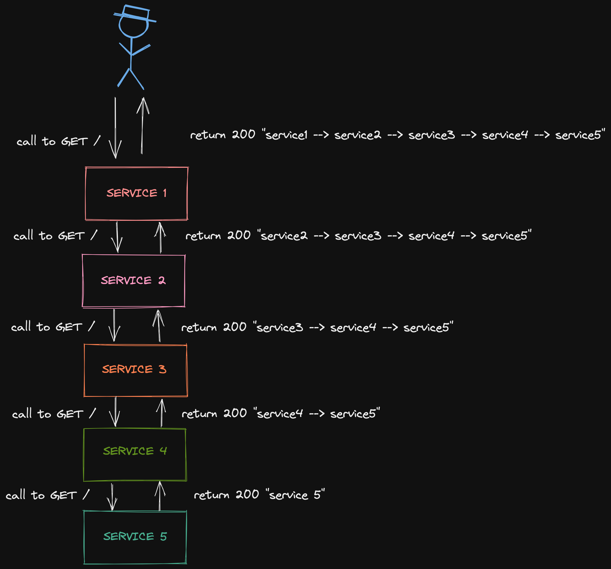

# Professor Chaos


This Repo demonstrates the microservices dependency with a depth of 5 microservices.The services are containerised with docker compose setup for local setups.It could be used to load test for a deployment setup.

Communication protcol/framework : `HTTP/REST`




### How to run 

1. Build binaries
```
make build-binary

```
2. Build containers
```
    docker-compose up --build
```